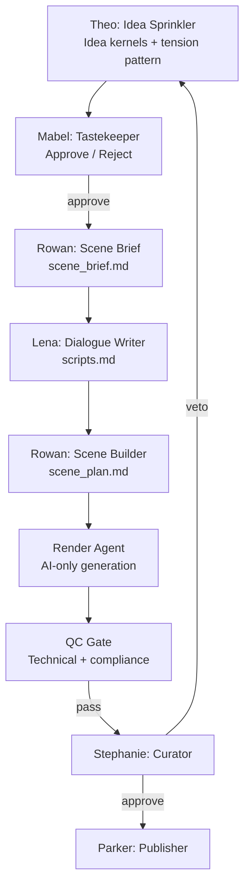

# The Stephanie Project — Workflow & Architecture (v1)

## Purpose
Create **AI-generated** short-form, clean comedy content that **Stephanie approves** and the family household can enjoy together.

**Key constraint (this version):** No real humans participate in the *creation* (acting/filming). All scenes, voices, and visuals are generated via tools/models. Stephanie remains the **taste authority / curator**.

## Principles (Non‑Negotiables)
- **Taste > optimization.** No agent should chase virality/trends.
- **One to Three beat comedy by default.** Sketch Comedy.
- **Character integrity.** Characters stay consistent enough to enable future vignettes.
- **No-post is allowed.** If nothing meets the bar, nothing ships.
- **Explicit feedback only.** Laughter/silence are not learning signals unless Stephanie states a preference.

## High-Level Workflow

## Deliverables per Step (Artifacts)
- **Theo →** `ideas.md` (10–30 premises, tagged: sketch / vignette-capable)
- **Mabel →** `approved_ideas.md` (shortlist + reasons + rejections)
- **Lena →** `scripts.md` (micro-script + alt punchlines + “silent version”)
- **Rowan →** `scene_plan.md` (beat sheet, character placement, shot list, length targets, storyboarding)
- **Evan →** `render_prompts/` (image/video prompts, voice script, subtitle text)
- **Quality Gate →** `qc_report.md` (issues, fixes applied, version)
- **Stephanie →** decision (approve/veto + optional note)
- **Parker →** `post_bundle/` (final MP4, caption copy, platform variants)

## Agent Interaction Contract
- Agents speak **only in their lane**; handoff is via artifacts.
- **Mabel** is the only agent that “represents Stephanie’s taste.”
- **Rowan** manages *character placement and continuity*.
- **Evan** has no editorial authority; it executes the plan.

## System States
- `DRAFT`: ideas/scripts/plans in progress
- `RENDERING`: generation running (video, VO, captions)
- `QC`: technical/taste checks
- `READY_FOR_CURATOR`: Stephanie review
- `PUBLISHED`: posted + archived
- `HOLD`: deferred or rejected

## Tooling & Orchestration Options (2026 snapshot)
You asked “Claude SDK or something else?” Here are common choices for multi-agent orchestration:

### Option A — Claude Agent SDK (Anthropic)
- Strong for tool-use from code, streaming tool calls, and structured orchestration. citeturn0search21turn0search13turn0search9
- Good fit if you want a **code-first** controller that calls: LLM → tools → LLM loops.

### Option B — OpenAI Responses API + Agents SDK
- Responses API is designed for **agentic loops** (multi-tool calls within a single request) and tool integrations. citeturn0search3turn0search0
- Good fit if you want a unified agent runtime with built-in web/file/image tooling.

### Option C — LangGraph (LangChain)
- Graph-based orchestration for stateful, multi-step workflows; durable execution patterns. citeturn0search4turn0search15turn0search1
- Good fit if you want **explicit control flow** and predictable handoffs.

### Option D — Microsoft Agent Framework / AutoGen ecosystem
- Agent Framework: enterprise-oriented guidance and patterns. citeturn0search16
- AutoGen: multi-agent conversation framework; note that docs indicate a shift in recommendations for newcomers. citeturn0search12turn0search2

### Practical recommendation for *this* project
Start with **one orchestrator** that is easy for you to maintain:
- If you want **simple + native tool loops**: OpenAI Responses/Agents SDK citeturn0search3turn0search0  
- If you want **Anthropic-first and code streaming**: Claude Agent SDK citeturn0search21turn0search13  
- If you want **workflow graphs and explicit state**: LangGraph citeturn0search4turn0search15

## “Up and running” definition (exit criteria)
You do **not** attempt long-form until:
- 10–20 sketches have shipped end-to-end with low friction
- character integrity remains stable
- vetoes don’t create pressure to “salvage”
- render/QC loop is reliable and repeatable
- In v1, vignette-capable is metadata only. No agent may exploit continuity.
---
